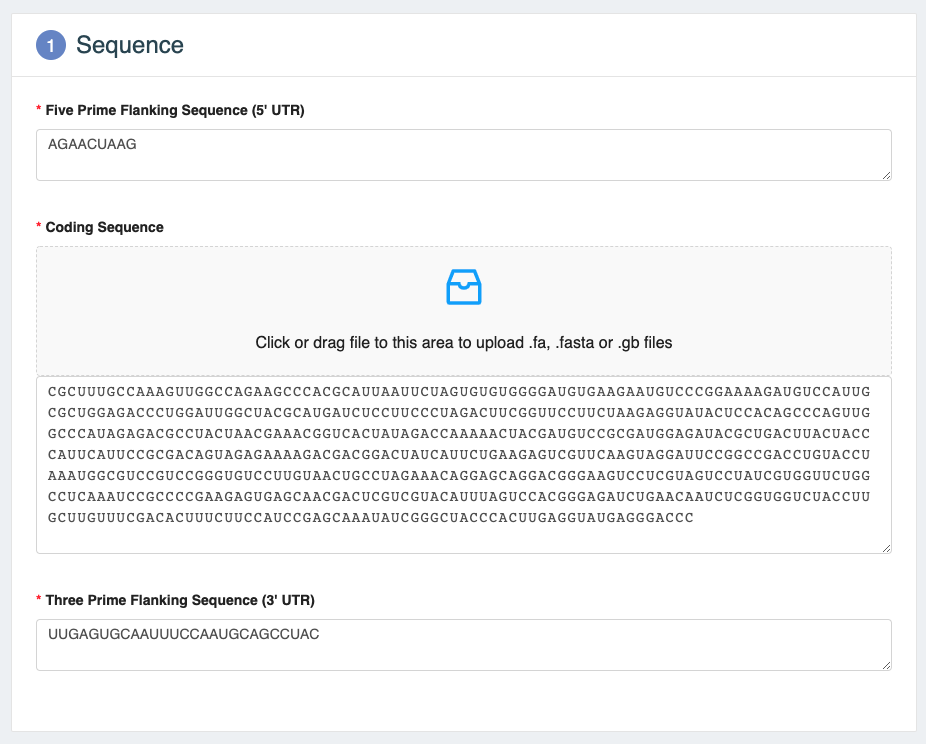
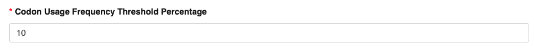
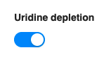
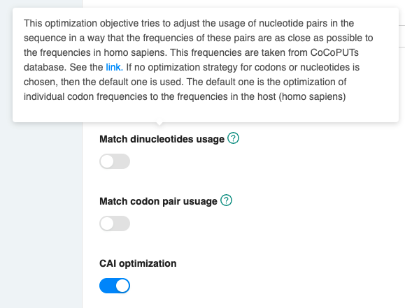
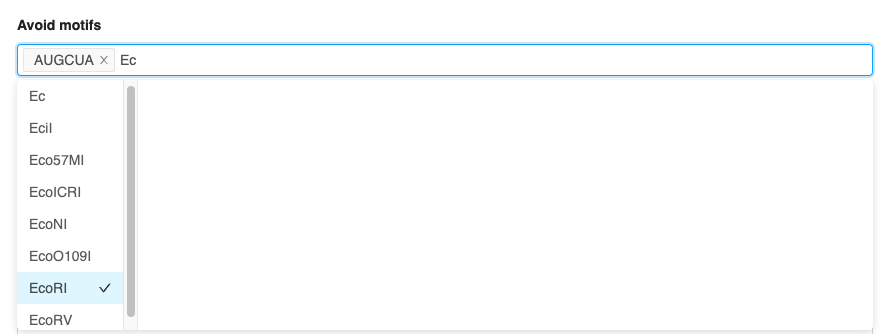
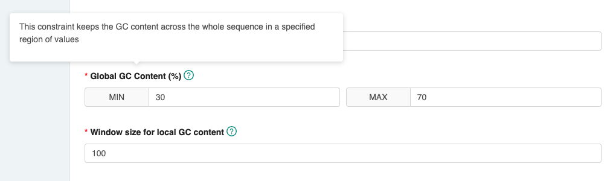
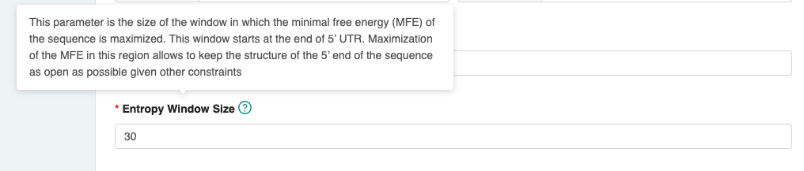
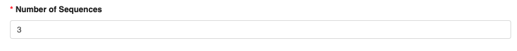
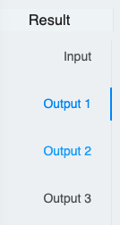
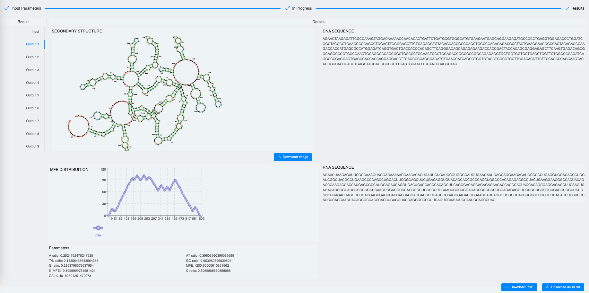

# User guide for mRNAid web app

This manual will guide you through the usage of the application step by step

## "Input parameters" page

This is the page where the user is redirected initially. It serves to predefine sequence of interest and optimization
parameters.

#### "Sequence" section

In this section user has to provide coding sequence, 5' UTR and 3' UTR sequences.

* Please input the sequence to be optimized: 5’ UTR, coding sequence (CDS), and 3’ UTR sequences in RNA or DNA format. 
You may cut and paste your sequence directly or drag and drop FASTA or GenBank files.  Green tick symbols indicate that 
your sequences are in the correct format.  There are validations performed on these input forms: only A,C,G,T,U symbols
are allowed and the coding sequence's length should be a multiple of three.

#### "Optimization parameters" section

In this section user has to specify parameters of the optimization job.

* Please choose the codon usage table that will be used for the optimization. It can be either *Homo Sapiens* or 
*Mus Musculus*.

* You may filter for rare codons by choosing a percentage threshold (Default 10%, meaning that codon with frequency less
 than 10% will be ignored).
 
* You may choose to deplete Uridine at the third position of every codon to improve expression and reduce immunogenicity.
 
* Please choose the desired codon optimization method. If none is selected, then the tool optimizes codon frequency to match
the one in the target host. You can also chose between "Match dinucleotides usage", "Match codon pair usage" or 
"CAI (Codon Adaptation Index) optimization". Please note the tooltip widget (hover over the question mark) that briefly
 explains on each method. Click the links within the text to get more familiar with each method.
 
* You may also choose the Minimum Free Energy (MFE) optimization method (default: stem-loop prediction – the faster option),
 for more precise MFE calculation on the expense of analysis time choose the ViennaRNA MFE calculation   
 
* User can choose motif (e.g. enzyme site) to avoid in the output optimized sequence. Simply choose the enzyme (e.g. EcoRI)
 from the drop down list or specify other custom motif.

 * You can set the range of the desired global GC content optimization (Default: 30-70%) 
* You must also set the sliding window for the local GC content optimization to make it uniformly distributed across the 
sequence  (Default: 100) 

* You must set the entropy window to be optimized for MFE (Default: 30).

* You have to select number of the optimized sequences in the output (Default: 10)

Where available you can use the tooltip widget to learn more about the parameters (hover over the question mark) 

On the bottom of the page you can see three buttons:

* Reset: Use it to drop the parameters
* Example: Use it to fill the forms with the example sequences and parameters
* Submit: Submit the optimization job

## "Results" page

mRNAid displays the input sequence in RNA and DNA formats, its corresponding secondary structure and MFE distribution along 
the sequence that can be downloaded directly. It also displays the values for the sequence including MFE, CAI, GC content
 etc. 
 
To navigate to optimized sequences user should use the panel on the left side of the page:

Optimized sequences are shown below. If two or more optimization runs result in the same sequence, this are shown 
 only once. A report with all optimized sequences can be downloaded in a PDF format and sequences along with their 
 respective parameters can be downloaded in Excel format too.  User can also zoom into the secondary stucture visualization
 and download an image of the selected region.
 

After the optimization is ready user can also navigate back to the input page selecting "Input parameters" section
in the navigation bar on top. If no new optimization has being started, user can also return to the results page selecting
"Results" option in the navigation bar.

